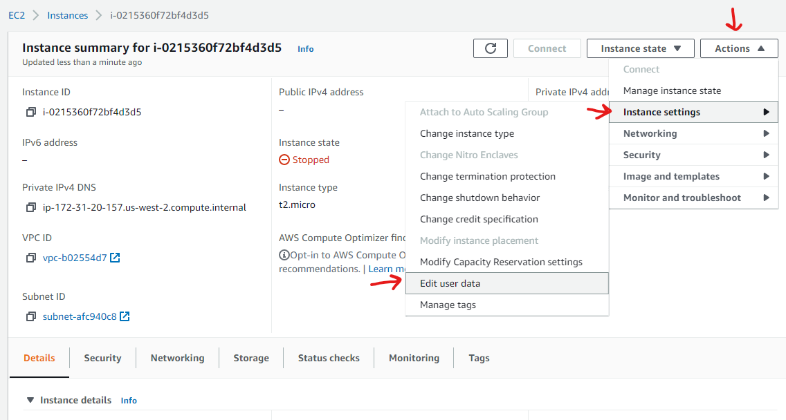

---
# Amazon ec2 ubuntu setup:

## connecting: 

mac terminal:  include path to key file or run terminal from the same directory as the key   LOWER CASE i or command will fail!

	ssh -i filename.pem username@ipaddress

example:

	ssh -i feckey.pem ubuntu@123.122.121.1

if permission error about file:   mac terminal checks to make sure the correct permissions are set on the key file so it cannot be modified except by the owner

	chmod 400 keyfilename.pem
 
In putty:
- Connection -> SSH -> Auth
- Choose a file

- login:
	- user: ubuntu
---
## Setup

Node version 14:

	curl -fsSL https://deb.nodesource.com/setup_14.x | sudo -E bash -
	sudo apt-get install -y nodejs

Git:

	sudo apt-get install git

port forwarding:

	sudo iptables -t nat -A PREROUTING -i eth0 -p tcp --dport 80 -j REDIRECT --to-port 3000

--- 
## Repo setup
clone repo

	git clone urlgoeshere

Setup npm packages: 
make sure you are in the repo directory when running this command

	npm i
___

## Security Rules  

Create security group: 

 

  

Add inbound and outbound rule for all traffic: 

   

Add security group to your instance: 

   

Type in the name you gave it, don't forget to save!: 

   
---

	
## File uploading:
- FTP client of your choice.
- You will need to add the key similar to in putty
- same IP
- same port 22

---
## server running after terminal close:

tmux is a virtual terminal that you can use to keep your server running. By default your server/app will stop running when the terminal is closed. If you start your server in a virtual terminal, it will continue to run even after your original terminal is closed.

- https://stackoverflow.com/questions/21193988/keep-server-running-on-ec2-instance-after-ssh-is-terminated
	

### to start:
	
	 tmux

this command creates and opens the virtual terminal, it will probably have different colors than your original window. Everything run now is done in this virtual terminal.  

### to disconnect:

	Ctrl+B, D (ie press Ctrl+B, then release both keys, and then press d)

note that the command is control + B, then d:  don't hold the first two down. This command brings you back to your original terminal and lets the virtual terminal continue on whatever it was doing

### when logging in again:

	tmux attach

the attach command tells the virtual terminal to reconnect you to it, allowing you to stop the server you have running or do any other commands

### if dc'd, reattach:

	tmux attach -d!

this command is not usually necessary. Used incase the virtual terminal can't reconnect you because it forgot your session for some reason, usually caused by connection dropout.

### Note:  
	if server stopped, all terminals will close as well and will not automatically reopen unless you have a start script

---

## Auto start script

	The instance must be fully stopped for this part. You will have to modify the script according to the command you want run when the instance starts. This script hasn't been tested much yet. Paths for server files may need to be fixed for directory discrepancies, ie app.use(express.static(path.join(__dirname, '../client/dist/'))); vs app.use(express.static'./client/dist/')); The former should still work for non instance deployments as well and is good practices to follow.

Go to Edit user data: 
   
Copy paste the script text in here, don't forget to save! 
   

Script:

	Content-Type: multipart/mixed; boundary="//"
MIME-Version: 1.0

	--//
	Content-Type: text/cloud-config; charset="us-ascii"
	MIME-Version: 1.0
	Content-Transfer-Encoding: 7bit
	Content-Disposition: attachment; filename="cloud-config.txt"

	#cloud-config
	cloud_final_modules:
	- [scripts-user, always]

	--//
	Content-Type: text/x-shellscript; charset="us-ascii"
	MIME-Version: 1.0
	Content-Transfer-Encoding: 7bit
	Content-Disposition: attachment; filename="userdata.txt"

	#!/bin/bash
	sudo -u ubuntu bash -c 'whoami;PATH=$PATH:/usr/local/bin;sudo iptables -t nat -A PREROUTING -i eth0 -p tcp --dport 80 -j REDIRECT --to-port 3000;cd project-catwalk; node server/index.js > server/server.log 2>  server/server_err.log'
	--//--

script explanation:

sudo -u ubuntu bash -c
- these scripts run as the root user, this command tells the terminal to use the ubuntu user instead to run the command given

whoami;PATH=$PATH:/usr/local/bin
- whoami print to terminal user name, left it in for testing purposes, not needed

PATH=$PATH:/usr/local/bin
- set path to appropriate, not entirely sure why it is needed

sudo iptables -t nat -A PREROUTING -i eth0 -p tcp --dport 80 -j REDIRECT --to-port 3000
- this command runs the ip table routing, for me this command has to be run after the instance is restarted so I have included it in this script

cd project-catwalk
- change directory to folder of repo, probably unnecessary

node server/index.js > server/server.log 2>  server/server_err.log
- command to run server, the 2 parts after are to tell node to log the outputs and errors to a file for laterviewing, remove if unwanted. The path seems to be wrong, they seem to be outputting to the base directory instead if you are looking for them.

Note: the quote ticks around the entire last section

